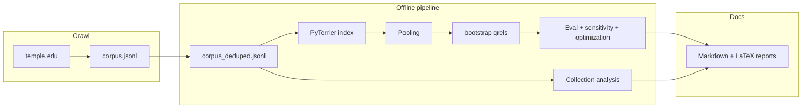

# How this IR system works (and what was hard)

This is a short companion to the code and to `reports/tex/00_system.tex`. Numbers in tables refresh when you run `python -m src.refresh_phase_outputs`.

## What runs where

| Stage | Script | Main outputs |
| --- | --- | --- |
| Crawl | `src/crawl_temple.py` | `data/raw/corpus.jsonl` (append, resumable) |
| Dedupe | `src/dedupe_corpus.py` or refresh | `data/raw/corpus_deduped.jsonl` (unique `docno`) |
| Index | `src/build_index.py` or refresh | `index/terrier/` |
| Collection analysis | `src/collection_analysis.py` | `outputs/analysis/*.csv`, `*.png` |
| Pooling | `src/pooling.py` | `data/processed/pooled_candidates.tsv` |
| Bootstrap qrels | `src/bootstrap_qrels.py` | `data/processed/qrels_bootstrap.tsv` (metrics only) |
| Evaluation | `src/evaluate_models.py` | `outputs/eval/*.csv` |
| BM25 sensitivity | `src/bm25_sensitivity.py` | `outputs/eval/bm25_sensitivity*.csv`, `.png` |
| Optimization | `src/optimization_experiment.py` | `outputs/optimization/optimization_results.csv` |
| Markdown reports | `src/update_reports.py` | `reports/week_*.md`, `final_report.md`, `DELIVERABLES.md` |
| LaTeX bundle | `src/export_latex_reports.py` | `reports/tex/*.tex` |

**One command** after crawling: `make refresh` (or `python -m src.refresh_phase_outputs`). That now **dedupes, rebuilds the index from the deduped corpus**, regenerates analysis through optimization, rewrites Markdown reports, and regenerates LaTeX under `reports/tex/`.

## Data flow (mental model)



## Challenges (honest list)

1. **Crawl restarts produced duplicate lines and inconsistent URL↔docno history.** Dedupe-by-first-`docno` and index-time `drop_duplicates` keep Terrier from crashing on duplicate `docno`.
2. **BFS resume used to starve** if “already saved” URLs were never enqueued for link expansion. The crawler now keeps two queues: **new URLs first**, **already-saved URLs only when the new queue is empty** (expansion-only fetches).
3. **Progress looked frozen** because tqdm advanced only when a *new* document was written, while thousands of HTTP requests could still be happening. Postfix counters (`fetched`, queue lengths) help; many subdomains still return **403** to automated clients, which caps how fast the corpus grows.
4. **PyTerrier + Java** needed a working JVM, absolute index paths, `text_attrs` on the indexer, and careful handling of `Experiment` tables (wide per-query vs aggregate metrics).
5. **`qrels.tsv` is still empty** for human judgments; all automated metrics use **bootstrap** qrels unless you replace the file and re-run eval—fine for plumbing, not for a graded relevance study.

## Build the PDF

```bash
cd reports/tex && pdflatex main.tex && pdflatex main.tex
```

`pdflatex` is optional if you only want the `.tex` sources in Git.
