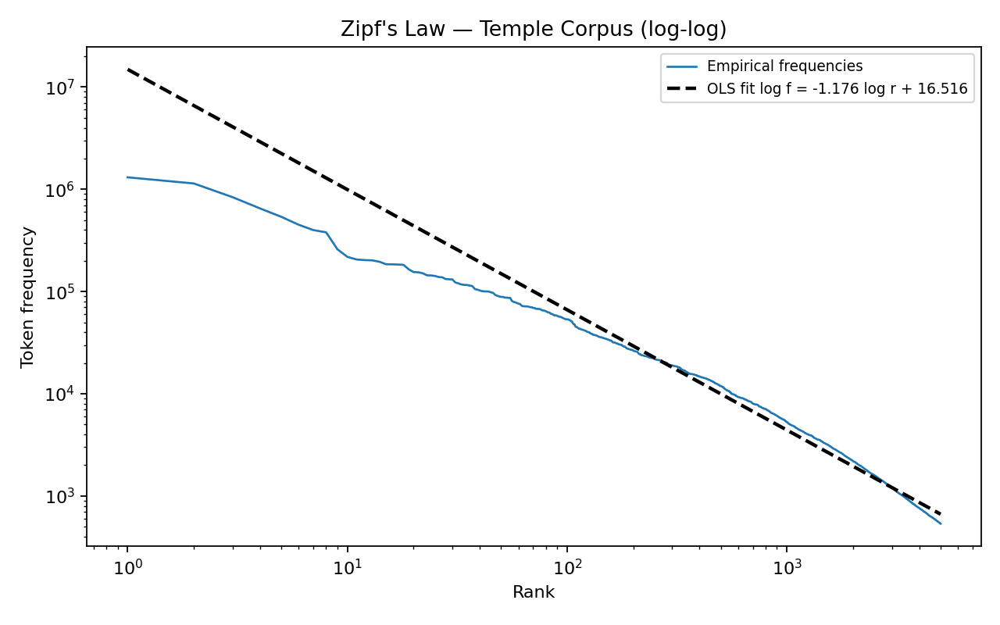
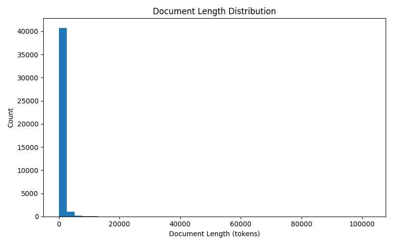
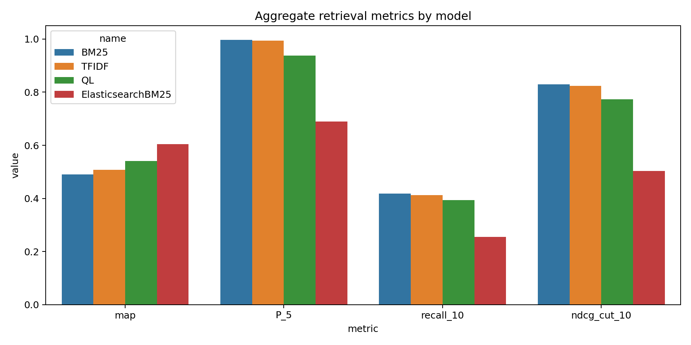
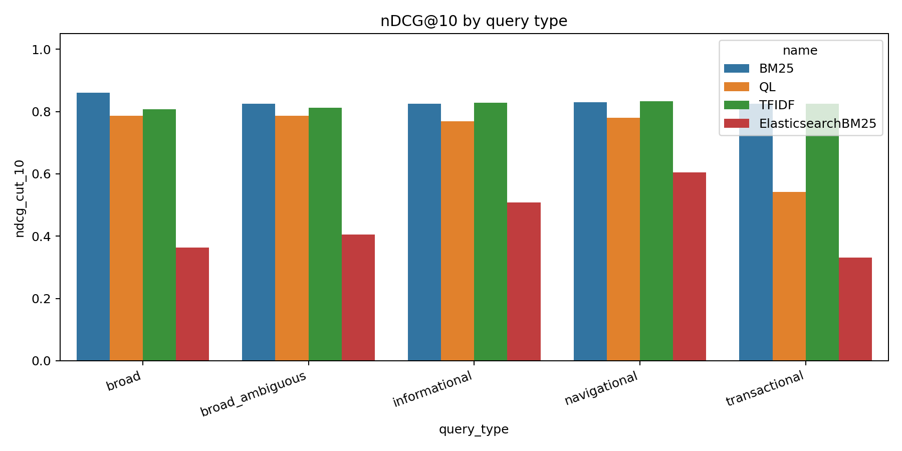
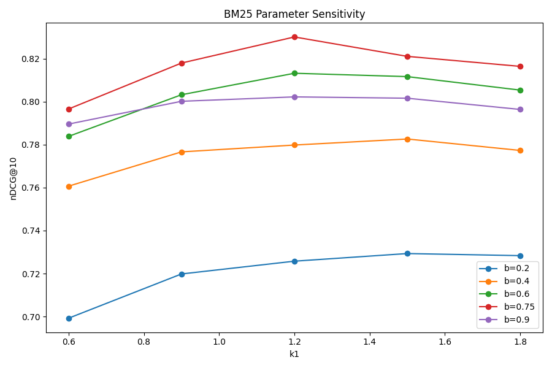
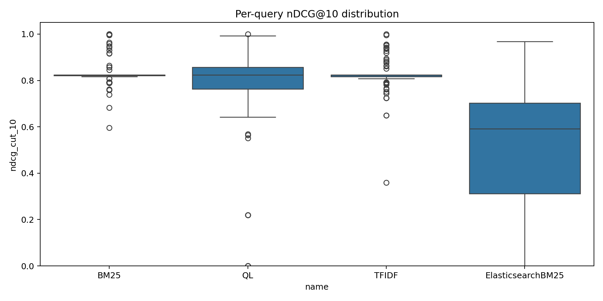

# Final project report (consolidated)

This document summarizes **figures, tables, and file paths** for the Temple IR project in one place.
When viewing from `reports/` on GitHub, figures use paths like `../outputs/...`.

## 1 Executive snapshot
- **Raw corpus lines:** 71876 (`data/raw/corpus.jsonl`)
- **Deduped docs:** 42217 (`data/raw/corpus_deduped.jsonl`)
- **PyTerrier index:** present at `index/terrier`
- **Queries (+ metadata):** 105 rows in `data/processed/query_templates.tsv`
- **Pool candidates (lines):** 2558 in `data/processed/pooled_candidates.tsv`
- **Graded qrels rows:** 2558 in `data/processed/qrels.tsv`
- **Bootstrap rank-1 qrels:** present (`data/processed/qrels_bootstrap.tsv`)
- **Evaluation qrels mode:** **human/official**

## 2 Reproduce everything
One command after crawl / query edits:
```bash
.venv/bin/python3 -m src.refresh_phase_outputs
```
Pieces:
```bash
.venv/bin/python3 -m src.collection_analysis --corpus data/raw/corpus_deduped.jsonl
.venv/bin/python3 -m src.evaluate_models --qrels data/processed/qrels.tsv
.venv/bin/python3 -m src.bm25_sensitivity --qrels data/processed/qrels.tsv
.venv/bin/python3 -m src.optimization_experiment
.venv/bin/python3 -m src.elasticsearch_experiment   # requires Elasticsearch on localhost:9200
.venv/bin/python3 -m src.plot_results
.venv/bin/python3 -m src.error_analysis
.venv/bin/python3 -m src.update_reports
```

## 3 Corpus & collection analysis

### Tables (`outputs/analysis/collection_summary.csv`)
| metric | value |
| --- | --- |
| documents | 42217.0 |
| vocabulary_size | 214003.0 |
| token_count | 37491119.0 |
| avg_doc_length | 888.0573939408296 |


File type counts (`outputs/analysis/file_type_distribution.csv`):
| file_type | count |
| --- | --- |
| html | 42217 |


Stopword / TF-IDF augmentation summary:
| stopword_fraction_nltk_only | corpus_stopword_fraction_tfidf_only | merged_stopword_fraction | non_stopword_fraction_after_merge | n_corpus_stopwords_tfidf | n_merged_stopwords |
| --- | --- | --- | --- | --- | --- |
| 0.2600005350600498 | 0.2711803294001441 | 0.5311808644601939 | 0.4688191355398061 | 250.0 | 448.0 |


Zipf OLS coefficients (first 5000 ranks):
| n_points_zipf_fit | log_rank_log_freq_slope | intercept_log_space |
| --- | --- | --- |
| 5000.0 | -1.176171673492852 | 16.516402086108755 |


Top 20 non-stop terms (after merged stoplist):
| term | count |
| --- | --- |
| temple | 449949 |
| certificate | 59746 |
| authored | 58385 |
| art | 53346 |
| credit | 52351 |
| must | 47759 |
| music | 43331 |
| tyler | 40360 |
| internships | 37757 |
| medicine | 37655 |
| following | 37162 |
| property | 35878 |
| klein | 35546 |
| additional | 34339 |
| phd | 33954 |
| credits | 33131 |
| communication | 31908 |
| design | 31628 |
| architecture | 30069 |
| args | 27489 |


Sample of corpus TF-IDF low-IDF terms (see full file):
| term | idf_sklearn_default |
| --- | --- |
| contact | 1.0931759294952232 |
| skip | 1.1289601953113726 |
| content | 1.1611627478734985 |
| university | 1.1640053214788797 |
| student | 1.2314504964236477 |
| faculty | 1.2347699270946273 |
| philadelphia | 1.2593936467789937 |
| school | 1.2659235781935878 |
| pa | 1.2812129199178923 |
| search | 1.313256214220505 |
| accessibility | 1.3203118920743664 |
| rights | 1.331599952868722 |
| main | 1.3332843723900956 |
| media | 1.3343096234183378 |
| resources | 1.334375804755225 |
| us | 1.3511610490943189 |
| social | 1.3882867715730798 |
| home | 1.388566208509475 |
| policies | 1.3930829438365728 |
| alumni | 1.3977964493447244 |
| students | 1.406792437053927 |
| copyright | 1.4121790549122506 |
| directory | 1.4170195957465 |
| tuportal | 1.417055539171553 |
| directions | 1.4218836814323297 |


### Figures
### Zipf (log-log) + dashed fit




### Document length distribution




### Word cloud (top non-stop terms)


## 4 Retrieval baselines (PyTerrier)

### Aggregate metrics
| name | map | P_5 | recall_10 | ndcg_cut_10 |
| --- | --- | --- | --- | --- |
| BM25 | 0.4897853550849345 | 0.9961904761904762 | 0.4184918391876504 | 0.8300558702936255 |
| TFIDF | 0.5078014044068315 | 0.9942857142857144 | 0.4127164492343494 | 0.8243925857440955 |
| QL | 0.5411758282026168 | 0.937142857142857 | 0.3935576203971061 | 0.7732880292938707 |


### Statistical tests (paired t-test, per-query nDCG@10)
| pair | t_stat | p_value |
| --- | --- | --- |
| BM25 vs TFIDF | 0.7931174587901323 | 0.4295150888826234 |
| BM25 vs QL | 3.150729810446085 | 0.002127288185289 |


## 5 Metrics by query type (PyTerrier)
| name | query_type | P_5 | ndcg_cut_10 | map | recall_10 |
| --- | --- | --- | --- | --- | --- |
| BM25 | broad | 1.0 | 0.8604761828284111 | 0.5912551063760253 | 0.4847389884460822 |
| BM25 | broad_ambiguous | 1.0 | 0.8256422562327261 | 0.4131058679732778 | 0.3880970976660631 |
| BM25 | informational | 0.9948717948717948 | 0.825158634093191 | 0.4805824520893251 | 0.413939719440809 |
| BM25 | navigational | 0.9941176470588234 | 0.8296512094978146 | 0.5212224025361117 | 0.4235524538485558 |
| BM25 | transactional | 1.0 | 0.8244657876659232 | 0.3942582714904143 | 0.3939393939393939 |
| QL | broad | 0.92 | 0.7870531495910108 | 0.6264843393176583 | 0.4307864192761218 |
| QL | broad_ambiguous | 0.96 | 0.7860883539073713 | 0.4695503018226337 | 0.3613470976660631 |
| QL | informational | 0.953846153846154 | 0.7694125615292213 | 0.5437870169059337 | 0.3915844532332281 |
| QL | navigational | 0.9294117647058824 | 0.7797675856972324 | 0.5666841780636602 | 0.4126197509305587 |
| QL | transactional | 0.6 | 0.5418783442266705 | 0.34632840907482 | 0.2439393939393939 |
| TFIDF | broad | 0.94 | 0.8066699384742506 | 0.5804480721258006 | 0.4408874293771319 |
| TFIDF | broad_ambiguous | 1.0 | 0.8128939874503878 | 0.4257778571858197 | 0.372161912480878 |
| TFIDF | informational | 1.0 | 0.827881303606981 | 0.5133254381928501 | 0.4128689636099333 |
| TFIDF | navigational | 1.0 | 0.8323629398051643 | 0.5322778768015306 | 0.429216066398578 |
| TFIDF | transactional | 1.0 | 0.8244657876659232 | 0.4409848484848485 | 0.3939393939393939 |


### Figure — model comparison & query types
### Aggregate metrics: baselines vs Elasticsearch




### nDCG@10 by query type




## 6 BM25 parameter sensitivity (human/official qrels)
Best grid point in this sweep: **k1=1.2**, **b=0.75**, nDCG@10=0.830056

### Table (`outputs/eval/bm25_sensitivity.csv`)
| k1 | b | ndcg@10 |
| --- | --- | --- |
| 0.6 | 0.2 | 0.6992340722462947 |
| 0.6 | 0.4 | 0.760657748984345 |
| 0.6 | 0.6 | 0.7838168731213069 |
| 0.6 | 0.75 | 0.7965508431384587 |
| 0.6 | 0.9 | 0.7895353186778753 |
| 0.9 | 0.2 | 0.7198155491658924 |
| 0.9 | 0.4 | 0.7765980724458089 |
| 0.9 | 0.6 | 0.8031793545220932 |
| 0.9 | 0.75 | 0.8179267125629596 |
| 0.9 | 0.9 | 0.8001322964763345 |
| 1.2 | 0.2 | 0.7257566624002764 |
| 1.2 | 0.4 | 0.7797796159579744 |
| 1.2 | 0.6 | 0.8131694163694957 |
| 1.2 | 0.75 | 0.8300558702936255 |
| 1.2 | 0.9 | 0.8021835741137701 |
| 1.5 | 0.2 | 0.7293062392735242 |
| 1.5 | 0.4 | 0.7825952219749901 |
| 1.5 | 0.6 | 0.8116107696899532 |
| 1.5 | 0.75 | 0.8210268489407514 |
| 1.5 | 0.9 | 0.8015628756326215 |
| 1.8 | 0.2 | 0.7283309705030542 |
| 1.8 | 0.4 | 0.777266976183059 |
| 1.8 | 0.6 | 0.8053336384047562 |
| 1.8 | 0.75 | 0.8163757662901775 |
| 1.8 | 0.9 | 0.7963414210704973 |


### Figure
### BM25 sensitivity curves




## 7 Optimization experiment (conjunctive vs disjunctive BM25)

### Results (`outputs/optimization/optimization_results.csv`)
| setting | latency_ms | docs_scored |
| --- | --- | --- |
| disjunctive | 1929.4830450003249 | 105000.0 |
| conjunctive | 1618.4531059998335 | 92390.0 |
| overlap_at_10 | 0.0 | 0.5202127659574468 |


## 8 Elasticsearch extension (optional; needs local ES)

### Aggregate Elasticsearch BM25
| name | map | P_5 | recall_10 | ndcg_cut_10 |
| --- | --- | --- | --- | --- |
| ElasticsearchBM25 | 0.6048140709232691 | 0.6895238095238095 | 0.2553940409046527 | 0.5027055516290783 |


### ES vs BM25 paired t-test (nDCG@10)
| pair | t_stat | p_value |
| --- | --- | --- |
| ElasticsearchBM25 vs PyTerrier BM25 | -12.732630164764656 | 6.013444336172372e-23 |


### Metrics by query type (Elasticsearch)
| query_type | map | P_5 | recall_10 | ndcg_cut_10 |
| --- | --- | --- | --- | --- |
| broad | 0.5569520667314105 | 0.52 | 0.2240079232996853 | 0.3626639035632454 |
| broad_ambiguous | 0.4798833604134194 | 0.55 | 0.1993171199809131 | 0.4047225221868748 |
| informational | 0.6073012660542491 | 0.7230769230769231 | 0.2487730794190888 | 0.5081510422865335 |
| navigational | 0.6980717615716125 | 0.7941176470588235 | 0.3098908062798177 | 0.6053661726244967 |
| transactional | 0.4595501509051072 | 0.5 | 0.1757575757575757 | 0.3313264616377837 |


### Figure — per-query dispersion
### Per-query nDCG@10 distribution




## 9 Inter-annotator-style agreement (kappa export)
| label_rows | cohen_kappa_quadratic |
| --- | --- |
| 100.0 | 0.605696249777006 |


## 10 Error analysis
**Full write-up:** `reports/error_analysis.md`

### Candidate failure queries (low BM25 nDCG@10)
- **Q016** — nDCG@10 = 0.5956
- **Q098** — nDCG@10 = 0.6826
- **Q051** — nDCG@10 = 0.7393
- **Q064** — nDCG@10 = 0.7595
- **Q084** — nDCG@10 = 0.7595

## 11 Artifact index (paths)
**Analysis:** `outputs/analysis/collection_summary.csv`, `file_type_distribution.csv`, `stopword_analysis.csv`, `corpus_tfidf_stopwords.csv`, `zipf_power_law_fit.csv`, `top20_non_stopwords.csv`, plots `*.png`  
**Eval:** `outputs/eval/aggregate_metrics.csv`, `per_query_metrics.csv`, `metrics_by_query_type.csv`, `paired_t_tests.csv`, `bm25_sensitivity*.csv`/`.png`, `cohen_kappa.csv`  
**Optimization:** `outputs/optimization/optimization_results.csv`  
**Extension:** `outputs/extension/es_*.csv`  
**Charts:** `outputs/charts/*.png`  
**Reports:** `reports/week_*.md`, `reports/error_analysis.md`, `reports/tex/` (LaTeX)

## Rubric checklist
See `reports/DELIVERABLES.md`.
